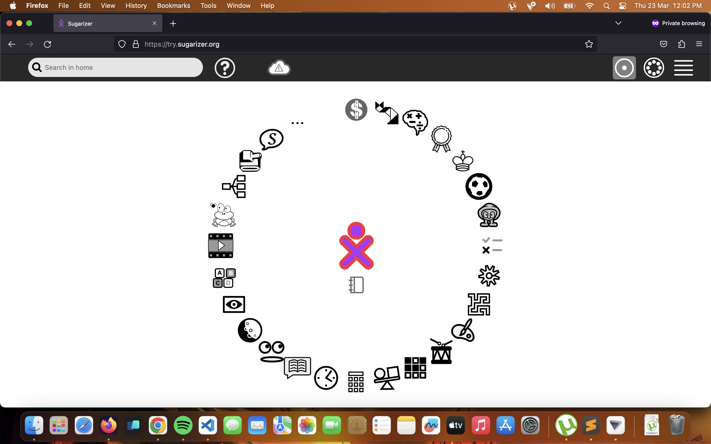

## GSOC'23 Proposal - Sugarlabs

### Sugarizer VueJS Core

### Basic Details:

*   Full Name: Abhinav Kumar
*   Email: [kumar.kr.abhinav@gmail.com](mailto:kumar.kr.abhinav@gmail.com)
*   Github Username: [kr-2003](https://github.com/kr-2003)
*   Your first language: Hindi
*   Location and Timezone: Time zone in Kasturba Gram, Indore, Madhya Pradesh 452020 (GMT+5:30)
*   Link to Resume/CV: [https://drive.google.com/file/d/1NF6XMtUzyY6VVbtgp5eKkO2Zp9vEayeB/view?usp=sharing](https://drive.google.com/file/d/1NF6XMtUzyY6VVbtgp5eKkO2Zp9vEayeB/view?usp=sharing)
*   I previously contributed to CircuitVerse on their cv-frontend-vue repo. These are the links:
    *   [https://github.com/CircuitVerse/cv-frontend-vue/pull/87](https://github.com/CircuitVerse/cv-frontend-vue/pull/87)
    *   [https://github.com/CircuitVerse/cv-frontend-vue/pull/97](https://github.com/CircuitVerse/cv-frontend-vue/pull/97)
    *   [https://github.com/CircuitVerse/cv-frontend-vue/pull/130](https://github.com/CircuitVerse/cv-frontend-vue/pull/130)
    *   [https://github.com/CircuitVerse/cv-frontend-vue/pull/127](https://github.com/CircuitVerse/cv-frontend-vue/pull/127)
    *   [https://github.com/CircuitVerse/cv-frontend-vue/pull/122](https://github.com/CircuitVerse/cv-frontend-vue/pull/122)
    *   [https://github.com/CircuitVerse/cv-frontend-vue/pull/116](https://github.com/CircuitVerse/cv-frontend-vue/pull/116)
    *   [https://github.com/CircuitVerse/cv-frontend-vue/pull/112](https://github.com/CircuitVerse/cv-frontend-vue/pull/112)
    *   [https://github.com/CircuitVerse/cv-frontend-vue/pull/111](https://github.com/CircuitVerse/cv-frontend-vue/pull/111)
    *   [https://github.com/CircuitVerse/cv-frontend-vue/pull/103](https://github.com/CircuitVerse/cv-frontend-vue/pull/103)
    *   [https://github.com/CircuitVerse/cv-frontend-vue/pull/102](https://github.com/CircuitVerse/cv-frontend-vue/pull/102)
    *   [https://github.com/CircuitVerse/cv-frontend-vue/issues/115](https://github.com/CircuitVerse/cv-frontend-vue/issues/115)
    *   [https://github.com/CircuitVerse/cv-frontend-vue/issues/109](https://github.com/CircuitVerse/cv-frontend-vue/issues/109)
*   Convince us that you will be a good fit for this project, by sharing links to your contribution to Sugar Labs
    *   Since I want to contribute to the VueJS implementation of Sugarizer, I tried implementing some components by myself. This is the link to the repository for the same:
        *   [https://github.com/kr-2003/sugarizer_personal_vuej](https://github.com/kr-2003/sugarizer_personal_vuejs)s
    *   I am Abhinav Kumar, a current undergraduate pursuing a degree in Computer Science from IIT Indore in India. My passions lie in software development, competitive programming, and cybersecurity. Throughout the past year, I have been refining my skills in software development and data structures and algorithms. More recently, I have started to contribute to open-source projects, with a specific interest in cybersecurity. I am well-versed in various tech stacks, including VueJS, ReactJS, NextJS, Javascript, ExpressJS, FastAPI, and MongoDB. I have built an online gaming website with five multiplayer games, heavily utilizing Javascript, DOM manipulation, and Websockets. I have designed the logic behind these games, providing me with a wealth of experience with Vanilla JS and DOM manipulation. Furthermore, I have developed multiple websites using ReactJS and VueJS, giving me hands-on experience with JS frameworks.
    *   Since I already have good experience with Javascript, Typescript, VueJS and I have also contributed to open source projects based on these tech stacks, I find myself suitable for this project.

## Overview of Project:

Sugarizer Core UI rely on EnyoJS, a deprecated frameworks initially developed for WebOS.  
The idea of this new project is to reimplement a part of Sugarizer Core UI using VueJS components.

**Tasks**

Use Sugarizer VueJS components and Sugarizer Server API to implement screens:

*   First screen
*   Login
*   Home view
*   List view
*   Settings

Each screen should integrate unit testing and code coverage.

## Details:

This project requires us to implement Sugarizer Core UI components in VueJS components. I have already tried to do some work.  [Click here](https://github.com/kr-2003/sugarizer_personal_vuejs) for the repo. The file structure is like this:

</img>


*   The project is using a build setup based on [Vite](https://vitejs.dev/) and allowing us to use Vue [Single-File Components](https://vuejs.org/guide/scaling-up/sfc.html) (SFCs).
*   I have added Vitest for unit testing.
*   Also added Cypress for E2E testing.
*   All the icons for the project are under “/src/assets/icons”.
*  [Vue I18n](https://kazupon.github.io/vue-i18n/introduction.html) is internationalization plugin of Vue.js. It easily integrates some localization features to your Vue.js Application.
   *  All the localization files are under ```/locales``` directory.
   * The localization is initialized in ```main.js``` file like this:
```javascript 
import { createApp } from 'vue'
import { createPinia } from 'pinia'
import { createI18n } from 'vue-i18n'
import en from '../locales/en.json'
import ar from '../locales/ar.json'
import de from '../locales/de.json'
import eu from '../locales/eu.json'
import es from '../locales/es.json'
import fr from '../locales/fr.json'
import ibo from '../locales/ibo.json'
import ja from '../locales/ja.json'
import pl from '../locales/pl.json'
import pt from '../locales/pt.json'
import yor from '../locales/yor.json'

import App from './App.vue'
import router from './router'

import './assets/main.css'

const app = createApp(App)

const i18n = createI18n({
  locale: 'en',
  messages: {
    en: en,
    ar: ar,
    de: de,
    es: es,
    eu: eu,
    fr: fr,
    ibo: ibo,
    ja: ja,
    pl: pl,
    pt: pt,
    yor: yor
  }
})

app.use(createPinia())
app.use(router)
app.use(i18n)

app.mount('#app')


```

* To get translation of any word, just use the following template:

```javascript 
<p class="icon-label">{{ $t('Login') }}</p>
```
This will give the translation of 'Login' in language that is set as 'locale' while initializing ```createI18n```.

* [Pinia](https://pinia.vuejs.org/introduction.html) is a store library for Vue, it allows you to share a state across components/pages. For this project, I have used Pinia for state management.
   

#### First Screen


*   All the components of firstScreen are under “/src/components/firstScreen”. 
*   The page for firstScreen is under “src/views/FirstScreenView.vue”.

```javascript
<template>
  <main>
    
    <div class="firstScreen-menu">
      <NewUserView></NewUserView>
      <router-link :to="{name: 'login'}"><LoginView></LoginView></router-link>
    </div>
  </main>
</template>

<script setup>
import NewUserView from '../components/firstScreen/NewUserView.vue'
import LoginView from '../components/firstScreen/LoginView.vue'
</script>

<style scoped>
.firstScreen-menu {
  position: absolute;
  top: 50%;
  right: 50%;
  transform: translate(50%, -50%);
}

</style>
```

*  \<router-link> is used for navigating through links.
  

#### Intro/Guide Tour

* Currently, I haven't worked upon intro/guide tour.
* The ```intro.js``` file in the main Sugarizer repo has around 3300 lines of JS code.
* There could be two ways to implement into guide in our Vue components:
  * First: Just directly copy-paste the logic of ```intro.js``` into the ```<script>``` tag of intro component.
  * Second: Re-write the logic of ```intro.js``` using Vue modern features.
* Obviously, the first way is easy and fast.
* If the time permits, I would try to implement ```intro.js``` in Vue modern syntax.


#### Login Screen
</img>

*   All the components of loginScreen are under “/src/components/loginScreen”. 
*   The page for loginScreen is under “src/views/LoginView.vue”.

```javascript  
<template>
  <div>
    <div class="login-wrapper">
      <div class="name-label">Name:</div>
      <loginInput></loginInput>
    </div>
    <IconButton
      @click="$router.go(-1)"
      id="left-button"
      iconButtonText="Back"
      iconButtonLink="go-left-icon"
    ></IconButton>
    <IconButton id="right-button" iconButtonText="Next" iconButtonLink="go-right-icon"></IconButton>
  </div>
</template>

<script setup>
import IconButton from '../components/IconButton.vue'
import loginInput from '../components/loginScreen/loginInput.vue'
</script>

<style scoped>
.name-label {
  position: relative;
  left: 20px;
  margin-top: 20px;
  color: #808080;
  margin-bottom: 20px;
  text-align: center;
}
.login-wrapper {
  position: absolute;
  top: 50%;
  right: 50%;
  transform: translate(50%, -50%);
}
</style>

```

* Vue-Router is used for navigation between different pages.
* Currently, only the frontend is implemented for the login screen.


#### Home View

This is the HomeView of original Sugarizer.
</img>

