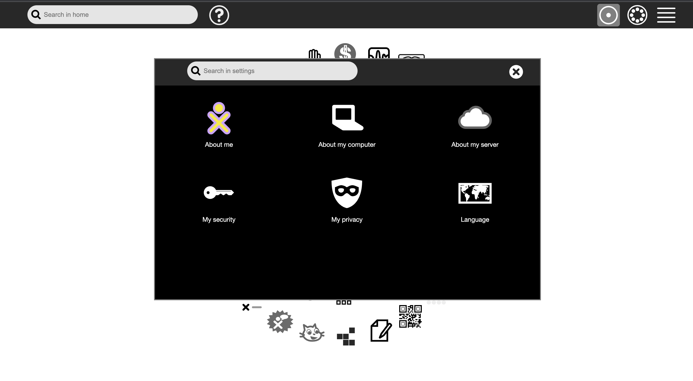

## GSOC'23 Proposal - Sugarlabs

### Sugarizer VueJS Core

### Basic Details:

- Full Name: Abhinav Kumar
- Email: [kumar.kr.abhinav@gmail.com](mailto:kumar.kr.abhinav@gmail.com)
- Github Username: [kr-2003](https://github.com/kr-2003)
- Your first language: Hindi
- Location and Timezone: Time zone in Kasturba Gram, Indore, Madhya Pradesh 452020 (GMT+5:30)
- Link to Resume/CV: [https://drive.google.com/file/d/1NF6XMtUzyY6VVbtgp5eKkO2Zp9vEayeB/view?usp=sharing](https://drive.google.com/file/d/1NF6XMtUzyY6VVbtgp5eKkO2Zp9vEayeB/view?usp=sharing)
- I previously contributed to CircuitVerse on their cv-frontend-vue repo. These are the links:
  - [https://github.com/CircuitVerse/cv-frontend-vue/pull/87](https://github.com/CircuitVerse/cv-frontend-vue/pull/87)
  - [https://github.com/CircuitVerse/cv-frontend-vue/pull/97](https://github.com/CircuitVerse/cv-frontend-vue/pull/97)
  - [https://github.com/CircuitVerse/cv-frontend-vue/pull/130](https://github.com/CircuitVerse/cv-frontend-vue/pull/130)
  - [https://github.com/CircuitVerse/cv-frontend-vue/pull/127](https://github.com/CircuitVerse/cv-frontend-vue/pull/127)
  - [https://github.com/CircuitVerse/cv-frontend-vue/pull/122](https://github.com/CircuitVerse/cv-frontend-vue/pull/122)
  - [https://github.com/CircuitVerse/cv-frontend-vue/pull/116](https://github.com/CircuitVerse/cv-frontend-vue/pull/116)
  - [https://github.com/CircuitVerse/cv-frontend-vue/pull/112](https://github.com/CircuitVerse/cv-frontend-vue/pull/112)
  - [https://github.com/CircuitVerse/cv-frontend-vue/pull/111](https://github.com/CircuitVerse/cv-frontend-vue/pull/111)
  - [https://github.com/CircuitVerse/cv-frontend-vue/pull/103](https://github.com/CircuitVerse/cv-frontend-vue/pull/103)
  - [https://github.com/CircuitVerse/cv-frontend-vue/pull/102](https://github.com/CircuitVerse/cv-frontend-vue/pull/102)
  - [https://github.com/CircuitVerse/cv-frontend-vue/issues/115](https://github.com/CircuitVerse/cv-frontend-vue/issues/115)
  - [https://github.com/CircuitVerse/cv-frontend-vue/issues/109](https://github.com/CircuitVerse/cv-frontend-vue/issues/109)
- Convince us that you will be a good fit for this project, by sharing links to your contribution to Sugar Labs
  - Since I want to contribute to the VueJS implementation of Sugarizer, I tried implementing some components by myself. This is the link to the repository for the same:
    - [https://github.com/kr-2003/sugarizer_personal_vuej](https://github.com/kr-2003/sugarizer_personal_vuejs)s
  - I am Abhinav Kumar, a current undergraduate pursuing a degree in Computer Science from IIT Indore in India. My passions lie in software development, competitive programming, and cybersecurity. Throughout the past year, I have been refining my skills in software development and data structures and algorithms. More recently, I have started to contribute to open-source projects, with a specific interest in cybersecurity. I am well-versed in various tech stacks, including VueJS, ReactJS, NextJS, Javascript, ExpressJS, FastAPI, and MongoDB. I have built an online gaming website with five multiplayer games, heavily utilizing Javascript, DOM manipulation, and Websockets. I have designed the logic behind these games, providing me with a wealth of experience with Vanilla JS and DOM manipulation. Furthermore, I have developed multiple websites using ReactJS and VueJS, giving me hands-on experience with JS frameworks.
  - Since I already have good experience with Javascript, Typescript, VueJS and I have also contributed to open source projects based on these tech stacks, I find myself suitable for this project.

## Overview of Project:

Sugarizer Core UI rely on EnyoJS, a deprecated frameworks initially developed for WebOS.  
The idea of this new project is to reimplement a part of Sugarizer Core UI using VueJS components.

**Tasks**

Use Sugarizer VueJS components and Sugarizer Server API to implement screens:

- First screen
- Login
- Home view
- List view
- Settings

Each screen should integrate unit testing and code coverage.

## Details:

This project requires us to implement Sugarizer Core UI components in VueJS components. I have already tried to do some work.  [Click here](https://github.com/kr-2003/sugarizer_personal_vuejs) for the repo. The file structure is like this:

</img>

- The project is using a build setup based on [Vite](https://vitejs.dev/) and allowing us to use Vue [Single-File Components](https://vuejs.org/guide/scaling-up/sfc.html) (SFCs).
- I have added Vitest for unit testing.
- Also added Cypress for E2E testing.
- All the icons for the project are under “/src/assets/icons”.
- [Vue I18n](https://kazupon.github.io/vue-i18n/introduction.html) is internationalization plugin of Vue.js. It easily integrates some localization features to your Vue.js Application.
  - All the localization files are under `/locales` directory.
  - The localization is initialized in `main.js` file like this:

```javascript
import { createApp } from "vue";
import { createPinia } from "pinia";
import { createI18n } from "vue-i18n";
import en from "../locales/en.json";
import ar from "../locales/ar.json";
import de from "../locales/de.json";
import eu from "../locales/eu.json";
import es from "../locales/es.json";
import fr from "../locales/fr.json";
import ibo from "../locales/ibo.json";
import ja from "../locales/ja.json";
import pl from "../locales/pl.json";
import pt from "../locales/pt.json";
import yor from "../locales/yor.json";

import App from "./App.vue";
import router from "./router";

import "./assets/main.css";

const app = createApp(App);

const i18n = createI18n({
  locale: "en",
  messages: {
    en: en,
    ar: ar,
    de: de,
    es: es,
    eu: eu,
    fr: fr,
    ibo: ibo,
    ja: ja,
    pl: pl,
    pt: pt,
    yor: yor,
  },
});

app.use(createPinia());
app.use(router);
app.use(i18n);

app.mount("#app");
```

- To get translation of any word, just use the following template:

```javascript
<p class="icon-label">{{ $t('Login') }}</p>
```

This will give the translation of 'Login' in language that is set as 'locale' while initializing `createI18n`.

- [Pinia](https://pinia.vuejs.org/introduction.html) is a store library for Vue, it allows you to share a state across components/pages. For this project, I have used Pinia for state management.

#### First Screen


- All the components of firstScreen are under “/src/components/firstScreen”.
- The page for firstScreen is under “src/views/FirstScreenView.vue”.

```javascript
<template>
  <main>

    <div class="firstScreen-menu">
      <NewUserView></NewUserView>
      <router-link :to="{name: 'login'}"><LoginView></LoginView></router-link>
    </div>
  </main>
</template>

<script setup>
import NewUserView from '../components/firstScreen/NewUserView.vue'
import LoginView from '../components/firstScreen/LoginView.vue'
</script>

<style scoped>
.firstScreen-menu {
  position: absolute;
  top: 50%;
  right: 50%;
  transform: translate(50%, -50%);
}

</style>
```

- \<router-link> is used for navigating through links.

#### Intro/Guide Tour

- Currently, I haven't worked upon intro/guide tour.
- The `intro.js` file in the main Sugarizer repo has around 3300 lines of JS code.
- There could be two ways to implement into guide in our Vue components:
  - First: Just directly copy-paste the logic of `intro.js` into the `<script>` tag of intro component.
  - Second: Re-write the logic of `intro.js` using Vue modern features.
- Obviously, the first way is easy and fast.
- If the time permits, I would try to implement `intro.js` in Vue modern syntax.

#### Login Screen

</img>

- All the components of loginScreen are under “/src/components/loginScreen”.
- The page for loginScreen is under “src/views/LoginView.vue”.

```javascript
<template>
  <div>
    <div class="login-wrapper">
      <div class="name-label">Name:</div>
      <loginInput></loginInput>
    </div>
    <IconButton
      @click="$router.go(-1)"
      id="left-button"
      iconButtonText="Back"
      iconButtonLink="go-left-icon"
    ></IconButton>
    <IconButton id="right-button" iconButtonText="Next" iconButtonLink="go-right-icon"></IconButton>
  </div>
</template>

<script setup>
import IconButton from '../components/IconButton.vue'
import loginInput from '../components/loginScreen/loginInput.vue'
</script>

<style scoped>
.name-label {
  position: relative;
  left: 20px;
  margin-top: 20px;
  color: #808080;
  margin-bottom: 20px;
  text-align: center;
}
.login-wrapper {
  position: absolute;
  top: 50%;
  right: 50%;
  transform: translate(50%, -50%);
}
</style>

```

- Vue-Router is used for navigation between different pages.
- Currently, only the frontend is implemented for the login screen.

#### Home View

This is the HomeView of original Sugarizer.
</img>


- This is [link](https://github.com/kr-2003/sugarizer/blob/master/js/homeview.js) to homeview.js of original sugarizer.
- This contains the javascript logic of the homeview.
- After seeing the code, and seeing how the website works, I obeserved that most of the components are dynamically rendered.
- It means that after meeting certain conditions and requirement, then we draw/show the components on the screen.
- We can implement this in Vue in following way:

  - Dynamically rendering of components.
  - First, we can already make components.
  - And then dynamically toggle components based on event listeners.
  - For example,

  ```javascript
  import Card1 from "./components/card1.vue";
  import Card2 from "./components/card2.vue";

  export default {
    data() {
      return {
        currentComponent: "Card1",
      };
    },
    methods: {
      toggle() {
        this.currentComponent =
          this.currentComponent === "Card1" ? "Card2" : "Card1";
      },
    },
    components: {
      Card1,
      Card2,
    },
  };
  ```

  ```javascript
  <template>
  <center>
    <h1 style="text-align: center;
        color: green">
        Sugarizer
    </h1>
    <strong>
        Vue.js Dynamic Components
    </strong>
    <br />
  </center>
  <center>
    <component :is="currentComponent" />
    <button @click="toggle">Toggle</button>
  </center>
  </template>
  ```

    * The above code when clicked on toggle button, the "toggle" method is called and accordingly current component is changed.
    * The components is bind to currentComponent.
    * This is how we can render dynamic components in VueJS.


* homeview.js is a huge file with around 900 lines of code. This isn't good practice. 
* We can refactor this code and split multiple functions into different files.
* And then import these functions in the main component in ```<script>``` tag.

#### List View

* This is [link](https://github.com/kr-2003/sugarizer/blob/master/js/listview.js) listview.js of original sugarizer.
* The way explained about HomeView, we can implement ListView in the same way.

#### Settings

* This is settings component of main Sugarizer.

</img>

* This is [link](https://github.com/kr-2003/sugarizer/blob/master/js/dialog.js) settings.js of original sugarizer.
* We can implement dialog in the same way as we will be implementing other components.
* We can implement modal/dialog this way:

```javascript 
<template>
  <div id="app">
    <button
      type="button"
      class="btn"
      @click="showModal"
    >
      Open Modal!
    </button>

    <Modal
      v-show="isModalVisible"
      @close="closeModal"
    />
  </div>
</template>

<script>
  import modal from './components/Modal.vue';

  export default {
    name: 'App',
    components: {
      Modal,
    },
    data() {
      return {
        isModalVisible: false,
      };
    },
    methods: {
      showModal() {
        this.isModalVisible = true;
      },
      closeModal() {
        this.isModalVisible = false;
      }
    }
  };
</script>

```

* The core concept behind this code is same as that for dynamically rendering components.
* Just this code is more specific towards dialog/modal.
* Initially, isModalVisible is false for the components.
* And it is toggled when appropriate method is called upon clicking.


#### Internationalization
* Currently, the cv-frontend-vue repo has ‘vue-i18n’ for internationalization.
* We can use ChatGPT for phrase translations.
* Following our some websites for translations:
  * Google Translate
  * Yandex Translate
  * Reverso
  * Translatedict
* We can use the above websites for getting translations for the phrases that we need to get translated.

* We need translation of many words and each phrase needs to be translated into 8 languages. This might take a lot of time and effort, if we are doing it one by one/manually.
* Therefore, to prevent unnecessary work, I will automate this work by using the API of above websites.
* For example, Reverso has reverso-api for node.

```npm install reverso-api```

```javascript
const Reverso = require("reverso-api");
const reverso = new Reverso();
reverso.getTranslation(
    'how is going?',
    'english',
    'chinese',
    (err, response) => {
        if (err) throw new Error(err.message)
        console.log(response)
    }
)
```

```javascript
{
  ok: true,
  text: 'how is going?',
  source: 'english',
  target: 'chinese',
  translations: [ '情况如何？' ],
  detected_language: 'eng',
  voice: 'https://voice.reverso.net/RestPronunciation.svc/v1/output=json/GetVoiceStream/voiceName=Lulu22k?inputText=5oOF5Ya15aaC5L2V77yf',
  context: {
    examples: [
      [Object], [Object],
      [Object], [Object],
      [Object], [Object],
      [Object], [Object],
      [Object], [Object]
    ],
    rude: false
  }
}
```

* Therefore, we can get results in ‘response.translation’.


#### Dockerize Application:
There are several advantages to Dockerising an application:
* Portability: Dockerising an application makes it highly portable, as it ensures that the application runs consistently across different environments. This means that you can move your application from one machine to another, or from one cloud provider to another, without having to worry about differences in the underlying infrastructure.
* Scalability: Docker makes it easy to scale up or down an application by allowing you to easily create or destroy containers as needed. This makes it easy to manage the resources required to run an application and ensures that you only use what you need.
* Isolation: Docker provides a high level of isolation between the application and the host system, which reduces the risk of conflicts and improves security. Each container runs as a separate process, with its own file system, network stack, and resources, which makes it easier to manage dependencies and versioning.
* Resource efficiency: Docker containers use less resources compared to virtual machines, as they share the host operating system kernel. This means that you can run more containers on a single machine, which can save costs on hardware and infrastructure.
* Rapid deployment: Docker makes it easy to deploy new versions of an application quickly and efficiently. By packaging the application and its dependencies into a container, you can deploy it to any environment that supports Docker, without having to worry about installation or configuration.
* DevOps Integration: Docker is widely used in DevOps workflows and enables teams to work together more efficiently. With Docker, developers can create an environment that mirrors production, which allows them to develop and test code locally before deploying it. Additionally, Docker enables continuous integration and deployment (CI/CD) pipelines, which automate the build, testing, and deployment of applications.

**Steps to dockerize Vue Application:**
* Create a Dockerfile: Create a Dockerfile in the root directory of your Vue application. The Dockerfile is a text file that contains instructions on how to build a Docker image. It specifies the base image to use, install dependencies, copies the application code into the image, and specifies the command to run when the image is started.

```Dockerfile
FROM node

WORKDIR /app

COPY ./package.json /app

RUN npm install

COPY . /app

EXPOSE 8080

CMD ["npm", "run", “dev”]
```

* Build the Docker image: Run the docker build command to build the Docker image using the Dockerfile.

```docker build -t my-vue-app .```

* Run the Docker container: Run the docker run command to start the Docker container using the Docker image that you just built.

```docker run -p 8080:8080 my-vue-app```


### Additional Information
**Why will I be able to complete my project in the timeline I have described?**
* Planning - A well planned project is more likely to be completed within the timeline. I have already planned out even the minute details for the project.
* Communication - Effective communication is critical for project completion. I have good communication skills and will be in regular touch with my mentors.
* Flexibility - Projects are unpredictable and changes are bound to occur. Being flexible and adaptable to changes can keep the project on track and within the timeline.
*  My past experience -
   * I have been contributing to Sugarizer. This project requires us to convert Sugarizer core components into Vue components. 
Link - https://github.com/kr-2003/sugarizer_personal_vuejs
   * For the past 1 month I have been regularly contributing to the cv-frontend-vue repo of CircuitVerse.
These are my [contributions](https://docs.google.com/document/d/1CNwTw03eeCbv0DFPIlHoaVQdQ3bo0R-QOg13pppkWjQ/edit) so far.
   *  My team got 3rd rank in the Enosium(hackathon).  We made a fully deployed website that took various details from the user and then provided an accurate prediction of their scope for repaying the loan using Next.JS, FastAPI, Scikit-Learn, Pandas and Numpy.
Link - https://github.com/kr-2003/enosium_track_1
   * My team got selected in top 20 in India for HackNITR hackathon. We made an Expenses Tracker App which can track your income and expenses by reading your transaction messages, and then show you, in one place your current financial standing using React Native.
Link - https://github.com/kr-2003/expenses-tracker-react-native
   * Route Planning for InterIIT - A last mile hub stores and delivers items. Efficient hubs require tools to measure dimensions, weight, and condition. Such tools can estimate volumetric weight by scanning items and flagging any errors. Created a website to integrate IOT and Algorithmic parts using Next.JS and Fast API.
Link - https://github.com/DaemonLab/Route-Planning
   * Social Media Website - It is a responsive website that allows different users to create profile, login, post content, upload images and connect with other users easily. It is a fully functional social media app built with ReactJS and MySQL.
Link - https://github.com/kr-2003/social_media_dbms_2
   * Created a responsive Web Application that will host 3 to 4 games. Players will be able to start a new game and invite others to join that game. A user can login/signup and can create an account. After that one is eligible to play 2- player/multiplayer games. These games are written in Javascript and are integrated with the backend. Socket.IO is used to make rooms, shareable links and change turns on client side. After each game history is stored in our database and is being displayed/updated in the profile section. Similarly, leaderboard for each game is being updated in leaderboard section. A user can visit other users' profile by clicking on their name in history or followers or leaderboard section. A user can also follow other users.
Link - https://github.com/kr-2003/IITISOC_OnlineGamesWebsite
   * Over the course of the past year, I have gained coding experience and developed a strong passion for programming. I am committed to my work and tend to be very driven, always striving to complete tasks ahead of schedule.

## THANKS